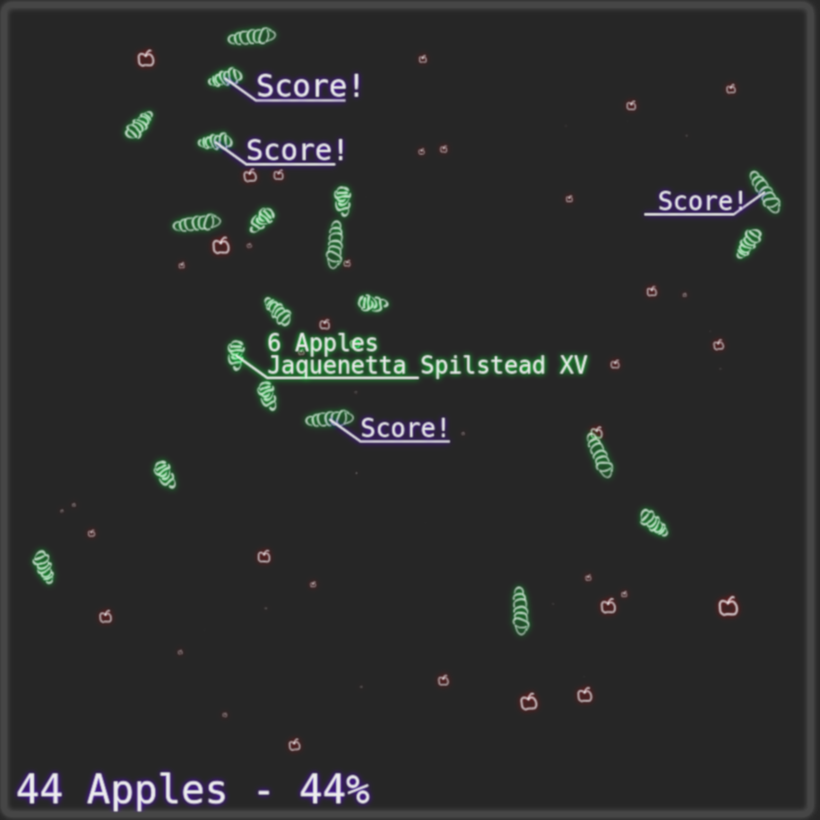

# TWO NEURONS WORM

This is a project for creating a worm that find it's food using [two neurons](https://phys.org/news/2018-07-reveals-complex-math-worms-food.html). We will be creating a two perceptron network that hopefully can find it's path to food. The perceptrons are trained genetically.

### Check it running [here!](https://armlessjohn404.github.io/two-neurons-worm/)

## Suggested Improvements/Bugs

1.  Slow iterations when there's too many objects in the screen (Grijó). **another day**
2.  ~~It's not mobile friendly/Other resolutions (Alcalá/Damas/Agostinho).~~
3.  ~~Check `monospace` font (Damas).~~
4.  ~~Update graph scale (Alcalá).~~
5.  ~~Color families (Alcalá).~~
6.  ~~Add feedback for high *eaten* percentage (Alcalá).~~
7.  ~~Adjust font sizes (Agostinho).~~~~
8.  ~~Error on first load (Dani).~~

Thank you guys for testing

## License

This program is free software: you can redistribute it and/or modify it under the terms of the GNU General Public License as published by the Free Software Foundation, either version 3 of the License, or (at your option) any later version.

This program is distributed in the hope that it will be useful, but WITHOUT ANY WARRANTY; without even the implied warranty of MERCHANTABILITY or FITNESS FOR A PARTICULAR PURPOSE. See the GNU General Public License for more details.

You should have received a copy of the GNU General Public License along with this program. If not, see http://www.gnu.org/licenses/.
